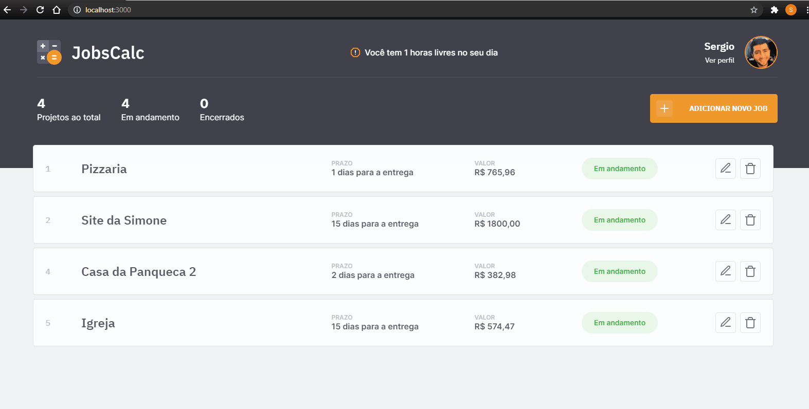

<h1 align="center">
  
</h1>

<p align="center">
  <a href="#-tecnologias">Tecnologias</a>&nbsp;&nbsp;&nbsp;|&nbsp;&nbsp;&nbsp;
  <a href="#-projeto">Projeto</a>&nbsp;&nbsp;&nbsp;|&nbsp;&nbsp;&nbsp;
  <a href="#-layout">Layout</a>&nbsp;&nbsp;&nbsp;|&nbsp;&nbsp;&nbsp;
  <a href="#memo-licença">Licença</a>
</p>

<p align="center">
 

  
</p>

<br>

<p align="center">
 

</p>

## 🚀 Tecnologias
Esse repositorio é minha versão de estudo pessoal da maratona Discover 2 da Rocket Seat!

Nesse projeto utilizei as tecnologias 
- HTML
- CSS
- JavaScript
- NodeJS
- EJS
- Express
- SQLite

Desenvolvemos uma aplicação funcional com interface de entrada de dados, armanezamento em banco SQL e ainda utilizando o padrão MVP para densenvolvimento e utilização do Express para emular um servidor.

## 💻 Projeto

O JobsCalc é uma aplicação de estimativa de cálculo para projetos freelancer, onde é possível cadastrar e excluir jobs (projetos), obtendo uma estimativa de custo de cada job. Além disso, é possível traçar o valor da hora da pessoa que estará usando o sistema 💰

## 🔖 Layout

Você pode visualizar o layout do projeto através [desse link](https://www.figma.com/file/s4fytPFbDiSkv4GPSfKaLE/Jobs-Planning). É necessário ter conta no [Figma](https://figma.com) para acessá-lo.


## Como reproduzir o projeto
É necessario ter NodeJs instalado na maquina no caso utilizei a versão `v15.12.0`.

Para consultar a versão entre no seu prompt de comando/terminal no caso de windows e execute o comando
```bash
node -v
```
Para iniciar o projeto é necessario instalar o gerenciador de pacotes `npm`
```bash
npm install
```

Depois acesse o terminal recomendo o utilizar o bash e execute o comando para iniciar o banco e criar as configurações iniciais:
```bash
npm run init-db
```
Depois para "startar" o servidor basta executar o comando
```bash
npm run dev
```


## :memo: Licença

Esse projeto está sob a licença MIT, cedida pela RocketSeat. Veja o arquivo [LICENSE](.github/LICENSE.md) para mais detalhes.

---

Feito com ♥ by Sergio Correa & Rocketseat :wave: [Participe da nossa comunidade!](https://discordapp.com/invite/gCRAFhc)
